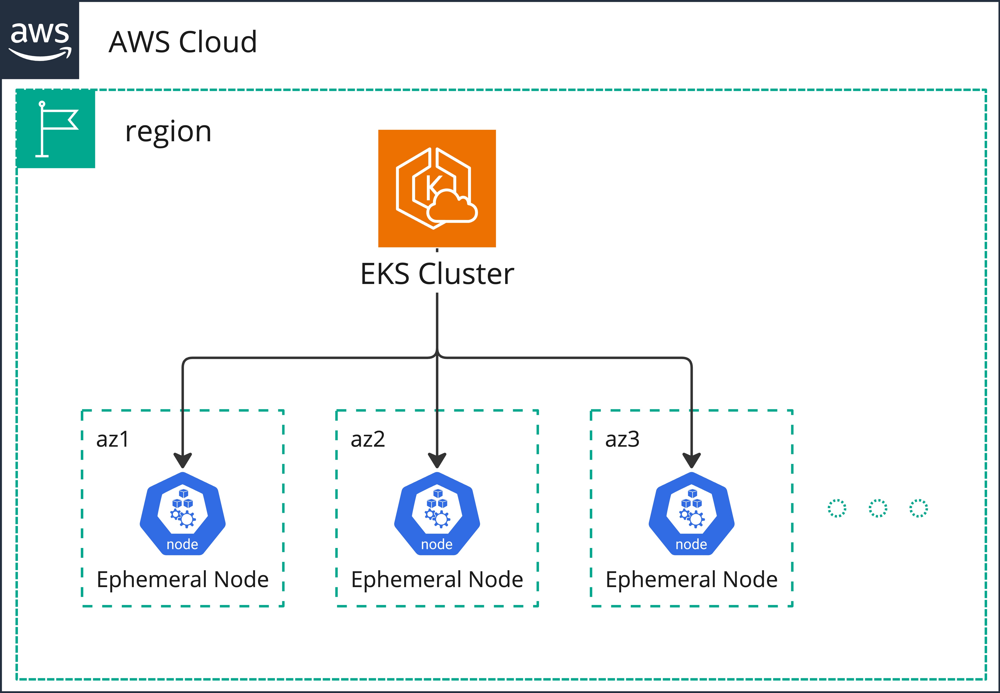

# Infrastructure

Sharedkube is built on top of the Amazon Web Services (AWS) cloud platform by
following Cloud Native principles.

## High-level overview

Each sharedkube cluster has an [EKS](https://aws.amazon.com/eks/) Cluster as
a base layer. We are utilizing ephemeral nodes to run the data plane. This
allows us to quickly scale the cluster up and down, perform seamless rolling
upgrades and recycle or just destroy the nodes anytime. It also allows us to:
* upgrade nodes by replacement instead of in-place upgrades,
* keep security patches up to date,
* reduce risk of infrastructure failures,
* optimize compute costs.

One of the major benefits of this approach is **Enforcing Engineering
Discipline**: Pod disruptions are no longer just possible; they’re guaranteed.
Engineers must treat high availability as critical when developing
applications.[^1] To achieve this, follow our
[Cloud Native Deployment Guide](../user-guides/cloud-native-deployment)
and say goodbye to downtime.

[^1]: [The Benefits of Running Kubernetes on Ephemeral Compute](https://blog.palantir.com/the-benefits-of-running-kubernetes-on-ephemeral-compute-436e5acf13fb)
