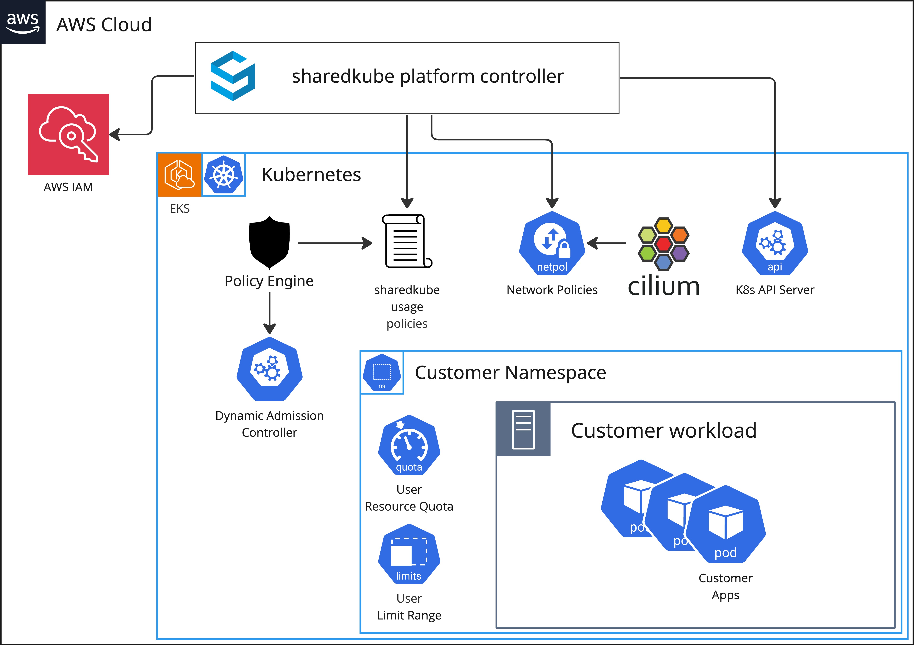

# Core

Now that you have a basic understanding of the sharedkube platform,
let's take a look at the architecture.

## Platform Components

The diagram below shows the high-level overview of the sharedkube platform.

### Sharedkube Platform Controller
Sharedkube Platform Controller is an application written in Python that is
responsible for managing the state of the platform. It is actively reconciling
state of sharedkube usage policies, network policies, customer namespaces
along with resource quotas and limit ranges.

### Policy Engine
Policy Engine is a service that is responsible for enforcing usage policies
on the platform. Both for the users and internal identities like Service
Accounts. Set of active policies is confidential on purpose. If you need
access to unavailable resource or action, please contact us, so we can 
consider enabling it for all users.

### Network Policies powered by Cilium
Network Policies are enforced by Cilium. Cilium is an open-source CNI plugin
that is responsible for managing network policies to isolate customers
workloads from each other.

### Customer Namespace
Customer Namespace is a Kubernetes namespace that is created for each customer
on the platform. It is used to isolate customers resources from each other by
utilizing Kubernetes RBAC and Network Policies. Users resources usage is
controlled using Kubernetes native objects - Resource Quotas and Limit Ranges.
