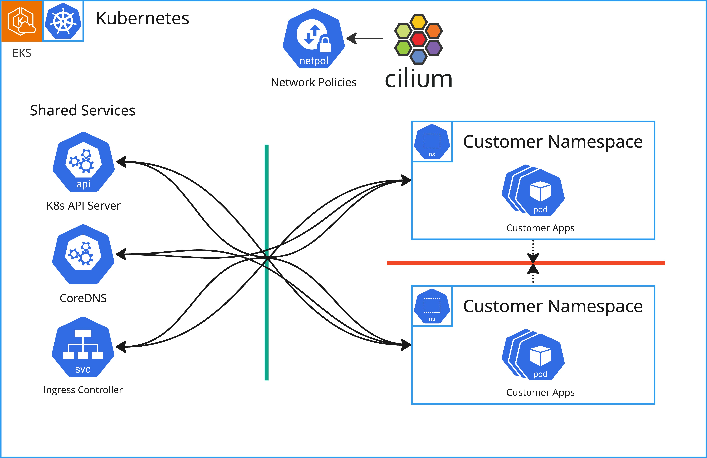
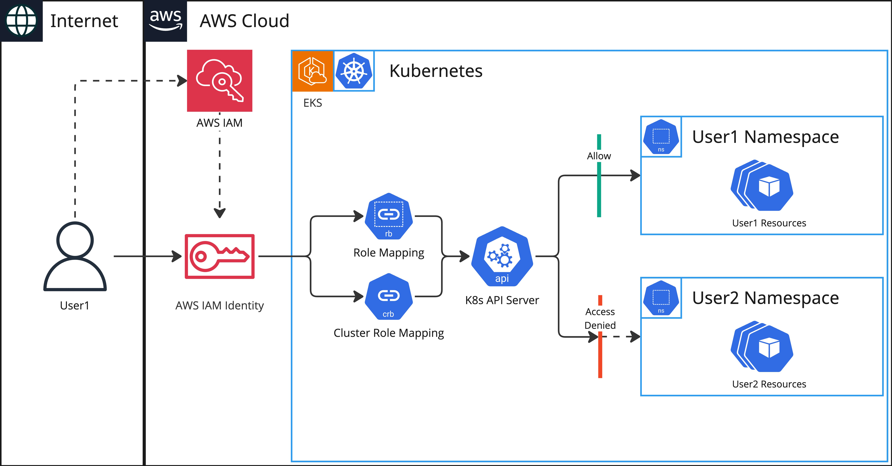

# Isolation

Customers resource isolation is being made on various levels to provide
the best possible security and performance.

## Network Isolation

We use [Cilium](https://cilium.io/) to enforce network policies on the
platform. Network policies block all traffic between customer namespaces
and allow only traffic to shared services like DNS, Kubernetes API, Ingress
Controllers and so on.

## Access Control

Access to the platform resources is controlled by native Kubernetes RBAC.
Each user mapped from AWS IAM has only access to assigned namespaces and
exceptional cluster-wide resources like Storage Classes, Endpoints and so on.

## Admission Control

We use Policy Engine to enforce usage policies on the platform. It is allowing
us to further reduce the scope of actions that can be performed by a
particular user to only those related to that user's resources. This includes
but is not limited to:
* `denying hostPath volumes` - to prevent access to host filesystem
* `denying privileged containers` - to prevent access to host resources
* `denying hostNetwork` - to prevent access to host network
* `allowing only authorized domains` - to use only owned domains
*  and many more...
