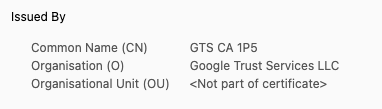

# Secure Traffic with SSL

Whether you use a free subdomain or a custom domain, you can secure your traffic with SSL.

### Securing free subdomain

First level of subdomain is secured with SSL by default. You can check it by opening your
subdomain in the browser. It should be marked as secured by `Google Trust Services`.

However, if you use deeper levels of subdomains like `level2.sk-chocolatefig.sharedkube.io`
or deeper, you need to request SSL certificate for your subdomain by contacting us via
[Slack](https://join.slack.com/t/sharedkube-community/shared_invite/zt-1ocap8cg6-boDX9eEPSQBQ0S6zllzcGA)
or [email](mailto:support@sharedkube.io).

### Securing custom domain

To secure your custom domain, you need to request SSL certificate for your domain by contacting
us via [Slack](https://join.slack.com/t/sharedkube-community/shared_invite/zt-1ocap8cg6-boDX9eEPSQBQ0S6zllzcGA)
or [email](mailto:support@sharedkube.io).
