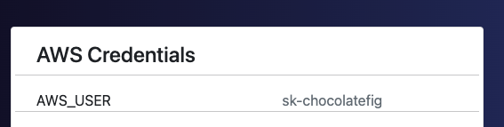

# Use Free Subdomain

In all sharedkube packages you have access to one free subdomain on sharedkube.io domain.
You can use it to expose your applications via 
[ingress](https://kubernetes.io/docs/concepts/services-networking/ingress/).

### Get your subdomain name

Your subdomain name is randomly generated and looks like this: `<generated_name>.sharedkube.io`.

To check your `generated_name` log in to [Dashboard](https://api.sharedkube.io) and check 
under `AWS Credentials` section the `AWS_USER` field. It will begin with `sk-` prefix.



This example user subdomain name is `sk-chocolatefig.sharedkube.io`. Feel free to also use
all deeper levels of subdomains like `level2.sk-chocolatefig.sharedkube.io` or 
`level3.level2.sk-chocolatefig.sharedkube.io` and so on.

### Use your subdomain to create ingress

To use your subdomain to create ingress, you need to set `spec.rules[0].host` field to your
subdomain name.

Here is an example of ingress manifest that uses `sk-chocolatefig.sharedkube.io` subdomain:

```yaml title="ingress.yaml"
apiVersion: networking.k8s.io/v1
kind: Ingress
metadata:
  name: my-release-nginx
  namespace: sk-chocolatefig
spec:
  ingressClassName: nginx
  rules:
// highlight-next-line
  - host: sk-chocolatefig.sharedkube.io
    http:
      paths:
      - backend:
          service:
            name: my-release-nginx
            port:
              name: http
        path: /
        pathType: ImplementationSpecific
```

Good job, you have just created your first ingress on sharedkube! 🎉
